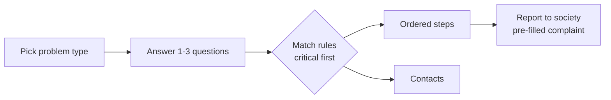
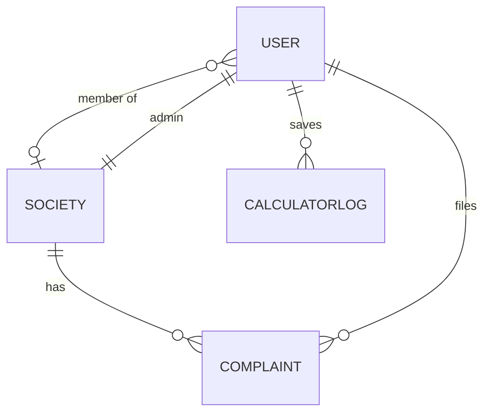

# AquaWise — Requirements Specification

Last updated: 2026-09-22 · Authors: Jaineel, [teammate name]

AquaWise is a MERN web portal with three graded functionalities: a household water calculator, a rule-based crisis advisory engine, and a society complaint portal. It maps to UN SDG 6, targets 6.1 (safe drinking water for all) and 6.4 (water-use efficiency).

| Item | Value |
| --- | --- |
| Course | Web Programming Laboratory, Sem 5, K J Somaiya |
| Team | 2 members |
| Stack | HTML5, CSS3, Bootstrap 5, JavaScript, React, Node.js/Express, MongoDB, express-session auth, Postman, cloud deploy |
| Grading | 3 working functionalities, code modularity, UI polish, documented testing, presentation |

Markers used in this document: **\[SRC n\]** = number taken from reference n in the References section; **\[ASSUMED\]** = a design value chosen by us, not from a published source. Every \[ASSUMED\] item is listed again in the Assumptions register at the end.

## 1. Problem statement

Globally, 2.1 billion people, one in four, still lacked safely managed drinking water in 2024, and 106 million drank untreated surface water \[SRC 1\]. India's position is acute. NITI Aayog's Composite Water Management Index (June 2018) reports nearly 600 million Indians facing high to extreme water stress and ranks India 120th of 122 countries on water quality \[SRC 2\]. It also estimates about two lakh deaths a year from inadequate access to safe water, with national demand projected to reach twice the available supply by 2030 \[SRC 3\].

Urban households add to this pressure without seeing it. Few know how their use compares with the 135–150 litres per capita per day that CPHEEO norms plan for \[SRC 4\]. Leaks alone can waste over 9,300 gallons (about 35,000 L) per household a year \[SRC 8\]. When supply fails or water turns unsafe, residents lack clear first steps and a channel to report it. AquaWise closes these gaps with a usage calculator, a crisis advisory engine and a society complaint portal.

*Flag: the leak figure \[SRC 8\] is US household data, used as an order-of-magnitude illustration. The two-lakh-deaths and 2030-demand figures come from a news report of the CWMI \[SRC 3\] because the NITI PDF could not be opened; cite the PDF directly if you can access it.*

## 2. Objectives

Each objective has a pass/fail check you can demonstrate in the viva and record in the test log. Targets marked \[ASSUMED\] are our own design targets.

| # | Objective | Measure of success |
| --- | --- | --- |
| O1 | Estimate household daily water use by activity | Calculator output matches hand-computed values from Section 7 formulas within ±1 L for 10 documented test households |
| O2 | Classify per-capita use against published norms | 100% of boundary test cases (19, 20, 54, 55, 99, 100, selected norm, norm+1, 200, 201 lpcd) land in the correct band from Section 7.3 |
| O3 | Give correct first-response guidance for 5 water problems | All 5 problem types × every severity in Section 8 (14 rules) return the right ordered steps and contacts; verified by one Postman/Jest test per rule |
| O4 | Route every complaint to the right handler | 100% of complaints filed in testing get the handler mapped to their category (Section 5.3, FR-S12); dashboard counts equal database counts |
| O5 | Deliver a usable, secure, deployed portal | Deployed on a public URL; all protected routes return 401 without a session; Lighthouse accessibility score ≥ 90 on 4 key pages \[ASSUMED target\] |

## 3. Scope

The build covers the three graded functionalities plus the auth and deployment they depend on; anything needing hardware, payments or live government systems is out.

| In scope | Explicitly out of scope |
| --- | --- |
| Calculator for one household, with activity breakdown and norm comparison | Metering or IoT sensor readings; any real measured consumption |
| Saving calculator runs for logged-in users and showing their history | Multi-year analytics, forecasting or ML-based predictions |
| Rule-based advisory for 5 problem types, 14 rules (Section 8) | AI/chatbot advice; medical diagnosis; lab-grade water-quality testing |
| Static contact directory: society contacts + national emergency 112 + one municipal example (Mumbai BMC 1916) | A verified contact database for every Indian city; automatic calls to authorities |
| Signup, login, logout with server-side sessions | OAuth / Google sign-in, OTP, JWT, password-reset email |
| Create society (admin), join society by code (resident) | Society approval workflows, maintenance billing, visitor management |
| File complaint, auto-route by category, status updates, dashboard | SMS/WhatsApp/push notifications; file or photo uploads \[ASSUMED out, to keep scope to 2 people\] |
| Responsive UI (Bootstrap 5), form validation client + server | Native mobile apps; offline mode; multiple languages |
| Postman collection + test log; one cloud deployment | Load testing at scale; CI/CD pipelines; custom domain |

## 4. Actors and permissions

Four actors: anyone can use the calculator and advisory; only society members touch complaints, and only the society admin changes their status. Enforce every "No" on the server (middleware), not just by hiding buttons.

| Capability | Guest | Resident | Society Admin | System Admin |
| --- | --- | --- | --- | --- |
| Use calculator, view result | Yes | Yes | Yes | Yes |
| Save calculator run, view own history | No | Yes | Yes | Yes |
| Use advisory engine | Yes | Yes | Yes | Yes |
| Sign up / log in | Yes | — | — | — |
| Create a society (gets a join code) | No | Yes (becomes its admin) | — | Yes |
| Join a society by code | No | Yes (one society at a time) | No | No |
| File a complaint | No | Yes, own society | Yes, own society | No |
| View complaints | No | Own complaints + society summary counts | All in own society | All |
| Change complaint status / add resolution note | No | No (may reopen own resolved complaint within 7 days) | Yes, own society | Yes |
| Edit society details and local contacts | No | No | Yes, own society | Yes |
| Deactivate users or societies | No | No | Remove member from own society | Yes |

- **Guest**: not logged in.
- **Resident**: logged-in user, `role: "resident"`.
- **Society Admin**: resident who created the society, `role: "society_admin"`; one admin per society.
- **System Admin**: seeded account for the team/demo, `role: "system_admin"`; not creatable through signup.

*\[ASSUMED\] One society per user, one admin per society, and the 7-day reopen window are our design choices to keep the model simple.*

## 5. Functional requirements

41 requirements in four groups; the IDs are what your test cases and Postman requests should reference.

### 5.1 Water Requirement & Usage Calculator (FR-C)

| ID | Requirement |
| --- | --- |
| FR-C1 | The system shall accept household inputs: adults, children, city type, bathing mode, showers per person per day, shower minutes, shower type, bucket baths per person per day, toilet type, washing-machine loads per week, machine type, garden area (m²), tap-running minutes per person per day, tap type, dripping taps, and optional litres actually received per day. |
| FR-C2 | The system shall pre-fill every optional input with the default in Section 7.2 and show the source beside it. |
| FR-C3 | The system shall compute daily litres for each activity using exactly the formulas in Section 7.2. |
| FR-C4 | The system shall compute household total (L/day) and per-capita use (lpcd) = total ÷ (adults + children). |
| FR-C5 | The system shall display the activity split as a bar or doughnut chart and as a table with litres and % of total. |
| FR-C6 | The system shall classify per-capita use into one band from Section 7.3 and show the band name, colour and the norm it was compared with. |
| FR-C7 | The system shall flag over-use when per-capita use exceeds the norm for the selected city type. |
| FR-C8 | The system shall flag under-supply when litres received per capita is below 55 lpcd, or below the household's estimated need. |
| FR-C9 | The system shall list the top 3 activities by litres with one saving tip each, and the litres saved if the efficient fixture value were used. |
| FR-C10 | The system shall compute results on the client for guests and on the server (POST /api/calculator) for logged-in users, using one shared formula module. |
| FR-C11 | The system shall save each logged-in run as a CalculatorLog and show the user's last 10 runs with date, total and band. |
| FR-C12 | The system shall reject invalid inputs with field-level messages per the ranges in Section 9.4. |

### 5.2 Crisis Advisory Engine (FR-A)

| ID | Requirement |
| --- | --- |
| FR-A1 | The system shall let the user pick one of 5 problem types: leakage, no supply, unsafe drinking water, low pressure, contamination. |
| FR-A2 | The system shall ask 1–3 yes/no or choice questions per problem type (Section 8) and derive severity from the answers. |
| FR-A3 | The system shall return the matching rule's ordered steps, numbered, in the order stored. |
| FR-A4 | The system shall show the rule's contacts with name, number and when to call; for the user's own society, contacts come from the Society record. |
| FR-A5 | The system shall show a red emergency banner with 112 for any rule of severity "critical". |
| FR-A6 | The system shall store rules as data (JSON file or MongoDB collection), not hard-coded if/else in UI components. |
| FR-A7 | The system shall expose GET /api/advisory/rules and POST /api/advisory/evaluate (problemType + answers → rule). |
| FR-A8 | The system shall offer a "Report this to my society" button for logged-in members that opens the complaint form pre-filled with category and severity. |
| FR-A9 | The system shall let the user print or copy the steps. |

### 5.3 Society Portal (FR-S)

| ID | Requirement |
| --- | --- |
| FR-S1 | The system shall let a guest sign up with name, email, phone, password. |
| FR-S2 | The system shall log a user in with email + password and create a server-side session. |
| FR-S3 | The system shall log out by destroying the session and clearing the cookie. |
| FR-S4 | The system shall let a resident create a society; the creator becomes its society admin. |
| FR-S5 | The system shall generate a unique 6-character join code for each society. |
| FR-S6 | The system shall let a resident with no society join one by entering a valid code, plus flat number and wing. |
| FR-S7 | The system shall let the society admin regenerate the join code; old codes stop working. |
| FR-S8 | The system shall let the society admin maintain local contacts (role, name, phone, categories handled). |
| FR-S9 | The system shall let a member file a complaint with category, title, description, location in the building and severity. |
| FR-S10 | The system shall assign each new complaint a readable ID (e.g., AQW-2026-0001). |
| FR-S11 | The system shall set new complaints to status "active". |
| FR-S12 | The system shall route each complaint by category to the society contact whose categories include it; if none, to the society admin. |
| FR-S13 | The system shall let the society admin move status active → in\_progress → resolved, with a note on each change. |
| FR-S14 | The system shall record each status change (who, when, from, to, note) in the complaint's history. |
| FR-S15 | The system shall let the filer reopen a resolved complaint within 7 days, setting it back to active. |
| FR-S16 | The system shall show a society dashboard: counts of active, in-progress and resolved; list filterable by status and category; local contacts panel. |
| FR-S17 | The system shall show residents only their own complaints in detail and society-wide counts. |

### 5.4 Common (FR-G)

| ID | Requirement |
| --- | --- |
| FR-G1 | The system shall provide a landing page explaining SDG 6 and linking to the three features. |
| FR-G2 | The system shall provide a navbar that changes with login state and role. |
| FR-G3 | The system shall return JSON errors as { error: { code, message, fields? } } with correct HTTP status. |

## 6. Non-functional requirements

All numeric targets in this section are \[ASSUMED\] design targets sized for a 2-person lab project on a free cloud tier; no external source sets them.

| ID | Area | Requirement |
| --- | --- | --- |
| NFR-U1 | Usability | Every page works at 360 px width with no horizontal scroll (Bootstrap grid, tested in Chrome DevTools device mode). |
| NFR-U2 | Usability | A first-time user completes a calculator run in ≤ 2 minutes and an advisory lookup in ≤ 3 clicks. |
| NFR-U3 | Usability | Every input has a visible label, unit (L, m², min) and help text; colour is never the only signal for a band (add text + icon). |
| NFR-U4 | Usability | Lighthouse accessibility ≥ 90 on Home, Calculator, Advisory, Dashboard. |
| NFR-V1 | Validation | Validate on the client (HTML5 attributes + React state) and again on the server (express-validator or Joi); the server is the authority. |
| NFR-V2 | Validation | Numeric inputs are integers or decimals inside the ranges in Section 9.4; out-of-range returns HTTP 400 with the field name. |
| NFR-V3 | Validation | Strings are trimmed; free text is length-capped and HTML-escaped on output (React escapes by default; never use dangerouslySetInnerHTML for user text). |
| NFR-S1 | Security | Passwords hashed with bcrypt, cost factor 12; never returned by any API. |
| NFR-S2 | Security | Sessions via express-session + connect-mongo; cookie httpOnly, sameSite "lax", secure in production, maxAge 2 h; session ID regenerated on login. |
| NFR-S3 | Security | Role/ownership checks in middleware (requireAuth, requireRole, requireSameSociety) on every protected route. |
| NFR-S4 | Security | Login rate-limited to 5 failed attempts per 15 min per IP (express-rate-limit). |
| NFR-S5 | Security | Secrets (Mongo URI, session secret) only in environment variables; .env in .gitignore. |
| NFR-S6 | Security | helmet() enabled; CORS restricted to the deployed frontend origin with credentials: true. |
| NFR-S7 | Security | Queries built with Mongoose only; reject keys beginning with $ in request bodies (express-mongo-sanitize) to block NoSQL injection. |
| NFR-P1 | Performance | API p95 response ≤ 500 ms for non-aggregate routes on the deployed instance with ≤ 20 concurrent users. |
| NFR-P2 | Performance | Calculator result renders ≤ 100 ms after submit for guests (client-side computation). |
| NFR-P3 | Performance | Indexes on User.email, Society.joinCode, Complaint {society, status}, CalculatorLog {user, createdAt}. |
| NFR-P4 | Performance | Dashboard complaint list paginated, 20 per page. |
| NFR-M1 | Modularity | Backend split into routes / controllers / models / middleware / services (calculator + advisory as pure-function services); frontend into pages / components / api / hooks. |
| NFR-M2 | Modularity | The calculator formula module and advisory rules are unit-tested independently of Express and React. |

## 7. Water-usage formulas and benchmarks

Daily household use is the sum of eight activity terms; per-capita use is that total divided by household size, then compared with Indian (CPHEEO, BIS, JJM) and WHO norms. US-unit sources are converted at 1 US gallon = 3.785411784 L (exact by definition); values below are rounded to 2 decimals.

### 7.1 Per-capita benchmarks

| Benchmark | Value (lpcd) | Meaning | Source |
| --- | --- | --- | --- |
| WHO — no access | < 5 | Consumption not assured; very high health concern | \[SRC 5\] |
| WHO — basic access | ≤ 20 | Drinking + basic hygiene only; high health concern | \[SRC 5\] |
| WHO — intermediate access | \~50 | Personal, food hygiene, laundry, bathing assured; low concern | \[SRC 5\] |
| Jal Jeevan Mission service level | 55 | Minimum "adequate" supply per person (rural tap connections), quality per BIS 10500 | \[SRC 6\] |
| CPHEEO — towns with piped water, no sewerage | 70 | Planning norm | \[SRC 4\] |
| WHO — optimal access | ≥ 100 | All consumption and hygiene needs met; very low concern | \[SRC 5\] |
| CPHEEO — cities with piped water + sewerage | 135 | Planning norm | \[SRC 4\] |
| CPHEEO — metropolitan/mega cities with sewerage | 150 | Planning norm | \[SRC 4\] |
| BIS IS 1172:1993 — bigger cities, full flushing | 150–200 | Upper design range | \[SRC 4\] |
| WHO — drinking + food preparation minimum | 7.5 | Meets most people's needs under most conditions | \[SRC 5\] |

*Mumbai users select "Metropolitan" (N = 150). The user's city-type choice sets N = 70, 135 or 150.*

### 7.2 Activity formulas

Let A = adults, C = children, P = A + C.

```latex
L_{total} = L_{bath} + L_{toilet} + L_{laundry} + L_{garden} + L_{tap} + L_{drink\&cook} + L_{utensils\&clean} + L_{leak}
```

```latex
L_{bath} = P \cdot \big( s \cdot m \cdot q_{shower} + b \cdot V_{bucket} \big)
```

```latex
L_{toilet} = P \cdot f \cdot V_{flush} \qquad L_{laundry} = \frac{w \cdot V_{load}}{7} \qquad L_{garden} = G \cdot 3.63
```

```latex
L_{tap} = P \cdot t \cdot q_{tap} \qquad L_{drink\&cook} = 7.5 \cdot P \qquad L_{utensils\&clean} = 20 \cdot P \qquad L_{leak} = 31.11 \cdot d
```

```latex
\text{lpcd} = \frac{L_{total}}{P}
```

| Symbol | Input / constant | Default or options (litres) | Source |
| --- | --- | --- | --- |
| s | Showers per person per day | 1 \[ASSUMED default\] | User input |
| m | Minutes per shower | 7.8 min | \[SRC 12\] REU2016 average |
| q\_shower | Shower flow | Standard 9.46 L/min (2.5 gpm); Efficient 7.57 L/min (2.0 gpm) | \[SRC 7\] |
| b | Bucket baths per person per day (if bathing mode = bucket) | 0 | User input |
| V\_bucket | Litres per bucket bath | 20 L | \[ASSUMED\] — ask users to measure their bucket |
| f | Flushes per person per day | 5.0 | \[SRC 12\] |
| V\_flush | Litres per flush | Old 22.71 (6 gpf); Standard 6.06 (1.6 gpf); Efficient 4.85 (1.28 gpf) | \[SRC 10\] |
| w | Washing-machine loads per week | User input | — |
| V\_load | Litres per load | Older/top-load avg 117.35 (31 gal); Standard 75.71 (20 gal); Efficient 53.00 (14 gal) | \[SRC 12\], \[SRC 11\] |
| G | Garden area watered, m² | 0 | User input |
| 3.63 | L per m² per day | 1 inch (25.4 mm = 25.4 L/m²) per week ÷ 7, rainfall included | \[SRC 13\] |
| t | Minutes tap left running per person per day (brushing, shaving, dishes under running tap) | 2 min \[ASSUMED default\] | User input |
| q\_tap | Tap flow | Standard 8.33 L/min (2.2 gpm); Aerated 5.68 L/min (1.5 gpm) | \[SRC 9\] |
| 7.5 | Drinking + cooking, L/person/day | Fixed | \[SRC 5\] |
| 20 | Utensils (10) + house cleaning (10), L/person/day | Fixed | \[ASSUMED\] — widely taught IS 1172 breakup; not verified against the standard itself |
| d | Taps dripping \~1 drop/second | 0 | User input |
| 31.11 | L/day per dripping tap | 3,000 gal/year ÷ 365 | \[SRC 8\] |

*\[ASSUMED\] Children use the same per-person constants as adults; no authoritative child-specific litre figure was found. A and C are still stored separately for display and future tuning.*

### 7.3 Band classification (evaluate top to bottom, first match wins)

| Order | Condition (x = lpcd, N = selected city norm) | Band | Flag | Basis |
| --- | --- | --- | --- | --- |
| 1 | x < 20 | Critical under-supply | Under-supply | Below WHO basic \[SRC 5\] |
| 2 | x < 55 | Under-supply | Under-supply | Below JJM 55 \[SRC 6\] and WHO intermediate \~50 \[SRC 5\] |
| 3 | x > 200 | Severe over-use | Over-use | Above IS 1172 upper 200 \[SRC 4\] |
| 4 | x > N | Over-use | Over-use | Above CPHEEO norm \[SRC 4\] |
| 5 | x < 100 | Basic | None | Meets 55, below WHO optimal 100 \[SRC 5\] |
| 6 | otherwise | Within norm | None | 100 ≤ x ≤ N |

**Supply check (FR-C8)**, only when the user enters litres received per day R: supplied lpcd = R ÷ P. If R ÷ P < 55 → flag "Under-supply vs JJM norm" \[SRC 6\]. Else if R < L\_total → flag "Supply below your estimated need by (L\_total − R) L/day".

### 7.4 Worked example (use as test case TC-C01)

2 adults + 2 children, Metropolitan (N = 150), 1 standard shower/person/day of 7.8 min, standard toilet, 5 standard machine loads/week, no garden, 2 min standard tap/person/day, 1 dripping tap.

| Activity | Calculation | L/day |
| --- | --- | --- |
| Bathing | 4 × 1 × 7.8 × 9.46 | 295.15 |
| Toilet | 4 × 5 × 6.06 | 121.20 |
| Laundry | 5 × 75.71 ÷ 7 | 54.08 |
| Garden | 0 × 3.63 | 0.00 |
| Taps | 4 × 2 × 8.33 | 66.64 |
| Drinking + cooking | 4 × 7.5 | 30.00 |
| Utensils + cleaning | 4 × 20 | 80.00 |
| Leak | 1 × 31.11 | 31.11 |
| **Total** |  | **678.18** |

Per capita = 678.18 ÷ 4 = 169.55 lpcd → rule 4, **Over-use** (above 150). Switching to efficient shower, toilet and machine drops it to 578.79 L/day, 144.70 lpcd, inside the norm; show that as the FR-C9 saving tip.

*Flag: most fixture figures are US (EPA/ENERGY STAR/WRF) because no Indian open-data source gives per-fixture litres. They are reasonable for Indian urban flats with Western fixtures but are not India-measured values; say so in the UI footnote.*

## 8. Advisory rule table

14 rules across 5 problem types; the engine asks the trigger questions, picks the first matching rule from the most severe down, and returns its steps in order. Severity levels: **low** (inconvenience), **medium** (fix within days), **high** (health or property risk), **critical** (act now; shows the 112 banner).



The complaint pre-fill maps problem type to Complaint.category one-to-one.

**Contact keys used below:** PLUMBER = licensed plumber; SOC\_MAINT = society maintenance in-charge (from Society.contacts); SOC\_ADMIN = society admin/secretary; MUNI = municipal water department (Mumbai: BMC helpline 1916 \[SRC 15\]; other cities: configurable); DOCTOR = nearest doctor/PHC; ERSS = 112, India's single emergency number routing to police, health and fire \[SRC 16\].

| Rule | Problem | Severity | Trigger (user answers) | Ordered steps | Contacts |
| --- | --- | --- | --- | --- | --- |
| LK-1 | Leakage | low | Dripping tap or running flush inside own flat; no wet walls | 1) Put a container under the drip. 2) Close the small valve under that tap or cistern if there is one. 3) Replace the washer/cartridge or flush flapper, or book a plumber. 4) Enter it as a dripping tap in the calculator: each one wastes about 31 L/day \[SRC 8\]. | PLUMBER, SOC\_MAINT |
| LK-2 | Leakage | medium | Pipe-joint leak, wall seepage or tank overflow; no standing water | 1) Close your flat's main inlet valve. 2) Unplug appliances and keep sockets near the wet wall off. 3) Photograph and mark the spot. 4) File a complaint (leakage). 5) Reopen the valve only for short periods until repaired. | SOC\_MAINT, PLUMBER |
| LK-3 | Leakage | critical | Burst pipe, water flooding the floor, or water near switches, meters or the lift | 1) Move everyone away from the water. 2) Switch off the flat's main breaker only if you can reach it without standing in water. 3) Close the main inlet valve; if it is a common line, ask security to close the building valve. 4) Call SOC\_ADMIN; call 112 for electrical hazard or injury. 5) If the burst is on the road main, report to MUNI. 6) File a complaint. | ERSS, SOC\_ADMIN, MUNI |
| NS-1 | No supply | low | Outage under 24 h, or announced cut; stored water available | 1) Check the society notice board and municipal announcements for a scheduled cut. 2) Ask neighbours: is it only your flat or the building? 3) Only your flat: check that your inlet valve is open. 4) Save stored water for drinking and cooking first (7.5 L/person/day minimum \[SRC 5\]). | SOC\_ADMIN |
| NS-2 | No supply | medium | Unannounced outage over 24 h across the building | 1) Ask SOC\_ADMIN to check tank levels and the pump. 2) SOC\_ADMIN registers a complaint with MUNI and shares the complaint number. 3) Ration to at least 20 L/person/day for drinking and basic hygiene \[SRC 5\]. 4) File an AquaWise complaint (no supply). | SOC\_ADMIN, MUNI |
| NS-3 | No supply | critical | Outage over 72 h, or under 7.5 L per person left, or an infant, elderly or ill member at home | 1) Ask SOC\_ADMIN to arrange a municipal or authorised tanker. 2) Treat tanker water before drinking as in UD-1 step 3. 3) Use water only for drinking and cooking. 4) SOC\_ADMIN escalates in writing to the ward office, quoting the complaint number. 5) Call 112 if anyone shows signs of dehydration. | SOC\_ADMIN, MUNI, ERSS |
| UD-1 | Unsafe drinking water | high | Odd taste, smell or colour, or tank not cleaned in over 6 months; nobody ill | 1) Stop drinking untreated tap water; use sealed bottled or treated water. 2) If cloudy, filter through a clean cloth or let it settle and draw off the clear water \[SRC 14\]. 3) Boil at a rolling boil for 1 minute, or add 2 drops of unscented 5–9% bleach per litre (8 drops per US gallon) and wait 30 minutes; double the bleach if cloudy \[SRC 14\]. 4) Store in clean, covered containers \[SRC 14\]. 5) Ask SOC\_ADMIN to clean the tanks and test water against BIS IS 10500 \[SRC 6\]. | SOC\_ADMIN, MUNI |
| UD-2 | Unsafe drinking water | critical | Anyone at home has diarrhoea, vomiting or fever after drinking the water | 1) See a doctor; call 112 if symptoms are severe or the patient is an infant or elderly. 2) Stop using that source entirely. 3) Treat all drinking water as in UD-1 step 3. 4) Tell SOC\_ADMIN so other residents are warned. 5) SOC\_ADMIN reports to MUNI. | DOCTOR, ERSS, SOC\_ADMIN, MUNI |
| LP-1 | Low pressure | low | Only one tap or shower is weak | 1) Unscrew and clean the aerator or shower-head mesh. 2) Check the valve under that fixture is fully open. 3) If still weak, book a plumber. | PLUMBER |
| LP-2 | Low pressure | medium | Whole flat is weak; neighbours are fine | 1) Check your flat's main inlet valve is fully open. 2) Leak test: close every tap and watch the meter; if it moves, follow LK-2. 3) Ask a plumber to check the inlet filter and pipes for blockage. 4) File a complaint (low pressure). | SOC\_MAINT, PLUMBER |
| LP-3 | Low pressure | medium | Whole building or area is weak | 1) Ask SOC\_ADMIN to check the overhead tank level and pump. 2) Check municipal supply timings for your ward. 3) SOC\_ADMIN registers a complaint with MUNI. 4) Store water during supply hours. | SOC\_ADMIN, MUNI |
| CT-1 | Contamination | high | Brown/yellow water or sediment; no sewage smell | 1) Do not drink it. 2) Run the cold tap until it clears; collect a sample in a clean bottle. 3) Treat drinking water as in UD-1 steps 2–4. 4) File a complaint (contamination). 5) Society cleans the tank; test against IS 10500 \[SRC 6\]. | SOC\_ADMIN, SOC\_MAINT, MUNI |
| CT-2 | Contamination | critical | Sewage smell, black water, worms or visible matter, or known sewage-line mixing | 1) Do not drink, cook or brush teeth with it; use sealed bottled water. 2) Photograph and collect a sample. 3) SOC\_ADMIN isolates the affected tank and reports to MUNI immediately. 4) SOC\_ADMIN warns all residents through the dashboard. 5) Reuse only after tank cleaning, disinfection and a passing IS 10500 test \[SRC 6\]. 6) Anyone ill: follow UD-2. | MUNI, SOC\_ADMIN, ERSS |
| CT-3 | Contamination | critical | Chemical, fuel or oily smell, or an oily film | 1) Do not drink or cook with it; boiling will not remove chemicals. 2) Use sealed bottled water. 3) Photograph and collect a sample. 4) SOC\_ADMIN reports to MUNI immediately and warns residents. 5) Anyone ill: call 112. | MUNI, SOC\_ADMIN, ERSS |

*\[ASSUMED\] The time thresholds (24 h, 72 h, 6 months) and the severity labels are our design choices, not from a standard. "Boiling will not remove chemicals" (CT-3) and the physical safety steps (breaker, valves) are general safety practice with no source opened here. The 2-drops-per-litre figure is our conversion of CDC's 8 drops per gallon. Replace 1916 with the correct municipal number for other cities.*

## 9. Data model (MongoDB / Mongoose)

Four collections; Society embeds its contacts and Complaint embeds its status history, so each dashboard view is one query. Every collection gets Mongoose `timestamps: true` (createdAt, updatedAt: Date, auto). All length limits and ranges are \[ASSUMED\] design values.



### 9.1 User

| Field | Type | Required | Validation / rules |
| --- | --- | --- | --- |
| \_id | ObjectId | auto | — |
| name | String | yes | trim; 2–60 chars; letters, spaces, . ' - only |
| email | String | yes | trim, lowercase; valid email format; **unique index** |
| phone | String | yes | exactly 10 digits, first digit 6–9 (Indian mobile) |
| passwordHash | String | yes | bcrypt hash (cost 12); `select: false`; plain password rule: 8–64 chars, ≥ 1 letter and ≥ 1 digit |
| role | String enum | yes | resident \| society\_admin \| system\_admin; default resident; never settable from signup body |
| society | ObjectId → Society | no | null until joined; one society per user |
| flatNo | String | if society set | trim; 1–10 chars; A–Z, 0–9, - / |
| wing | String | no | trim; 0–10 chars |
| isActive | Boolean | yes | default true; inactive users cannot log in |
| lastLoginAt | Date | no | set on successful login |

### 9.2 Society

| Field | Type | Required | Validation / rules |
| --- | --- | --- | --- |
| \_id | ObjectId | auto | — |
| name | String | yes | trim; 3–80 chars |
| joinCode | String | yes | exactly 6 chars from A–Z and 2–9 (no 0, O, 1, I); uppercase; **unique index**; regenerated on request (FR-S7) |
| address.line1 | String | yes | 5–120 chars |
| address.area | String | yes | 2–60 chars |
| address.city | String | yes | 2–60 chars; default "Mumbai" |
| address.pincode | String | yes | exactly 6 digits, first digit 1–9 |
| cityType | String enum | yes | metro \| city\_sewered \| town\_unsewered; sets norm N = 150 / 135 / 70 \[SRC 4\] |
| municipalHelpline | String | no | 3–15 digits; default "1916" when city is Mumbai \[SRC 15\] |
| admin | ObjectId → User | yes | must be a member; exactly one |
| memberCount | Number | yes | integer ≥ 1; updated on join/leave |
| contacts | Array of Contact | no | max 20 entries |
| contacts\[\].role | String | yes | 2–40 chars, e.g., "Maintenance in-charge", "Plumber" |
| contacts\[\].name | String | yes | 2–60 chars |
| contacts\[\].phone | String | yes | 10 digits (mobile) or 3–15 digits (landline/helpline) |
| contacts\[\].categories | \[String enum\] | yes | ≥ 1 of the Complaint.category values; used for routing (FR-S12) |
| isActive | Boolean | yes | default true |

### 9.3 Complaint

| Field | Type | Required | Validation / rules |
| --- | --- | --- | --- |
| \_id | ObjectId | auto | — |
| complaintNo | String | yes | format AQW-YYYY-NNNN, sequential per year; **unique index** |
| society | ObjectId → Society | yes | must equal the filer's society |
| filedBy | ObjectId → User | yes | from session, never from body |
| category | String enum | yes | leakage \| no\_supply \| unsafe\_drinking\_water \| low\_pressure \| contamination \| other |
| severity | String enum | yes | low \| medium \| high \| critical; pre-filled from advisory rule, editable by filer |
| advisoryRuleId | String | no | one of LK-1…CT-3 when filed from the advisory (FR-A8) |
| title | String | yes | trim; 5–80 chars |
| description | String | yes | trim; 10–1000 chars |
| location | String enum | yes | own\_flat \| common\_area \| overhead\_tank \| underground\_tank \| road\_main |
| assignedContact | Object {role, name, phone} | yes | snapshot copied at filing: first Society.contacts entry whose categories include this category; else the admin's name and phone |
| status | String enum | yes | active \| in\_progress \| resolved; default active |
| statusHistory | Array | yes | appended on every change; never edited |
| statusHistory\[\].from | String enum \| null | yes | null for the first entry |
| statusHistory\[\].to | String enum | yes | allowed moves only: active→in\_progress, in\_progress→resolved, active→resolved, resolved→active (reopen, filer only, ≤ 7 days) |
| statusHistory\[\].by | ObjectId → User | yes | from session |
| statusHistory\[\].note | String | yes for admin moves | 0–300 chars |
| statusHistory\[\].at | Date | yes | server time |
| resolvedAt | Date | no | set when status becomes resolved; cleared on reopen |
| Indexes | — | — | { society: 1, status: 1, createdAt: -1 }; { filedBy: 1, createdAt: -1 } |

### 9.4 CalculatorLog

| Field | Type | Required | Validation / rules |
| --- | --- | --- | --- |
| \_id | ObjectId | auto | — |
| user | ObjectId → User | yes | from session |
| inputs.adults | Number | yes | integer 1–20 |
| inputs.children | Number | yes | integer 0–20; adults + children ≤ 30 |
| inputs.cityType | String enum | yes | metro \| city\_sewered \| town\_unsewered |
| inputs.bathingMode | String enum | yes | shower \| bucket \| both |
| inputs.showersPerPersonPerDay | Number | if mode ≠ bucket | 0–5, step 0.5 |
| inputs.showerMinutes | Number | if mode ≠ bucket | 1–60; default 7.8 \[SRC 12\] |
| inputs.showerType | String enum | if mode ≠ bucket | standard \| efficient |
| inputs.bucketBathsPerPersonPerDay | Number | if mode ≠ shower | 0–5, step 0.5 |
| inputs.toiletType | String enum | yes | old \| standard \| efficient |
| inputs.machineLoadsPerWeek | Number | yes | integer 0–21 |
| inputs.machineType | String enum | if loads > 0 | older \| standard \| efficient |
| inputs.gardenAreaM2 | Number | yes | 0–1000; default 0 |
| inputs.tapMinutesPerPersonPerDay | Number | yes | 0–60; default 2 |
| inputs.tapType | String enum | yes | standard \| aerated |
| inputs.drippingTaps | Number | yes | integer 0–20; default 0 |
| inputs.suppliedLitresPerDay | Number | no | 0–20000 |
| results.byActivity | Object of Numbers | yes | keys bath, toilet, laundry, garden, tap, drinkCook, utensilsClean, leak; each ≥ 0, 2 decimals |
| results.totalLitresPerDay | Number | yes | ≥ 0; equals sum of byActivity ± 0.01 |
| results.perCapitaLpcd | Number | yes | total ÷ (adults + children) |
| results.normLpcd | Number | yes | 70 \| 135 \| 150 |
| results.band | String enum | yes | critical\_undersupply \| undersupply \| basic \| within\_norm \| overuse \| severe\_overuse |
| results.flags | \[String enum\] | yes | overuse \| undersupply\_norm \| supply\_below\_need; may be empty |
| formulaVersion | String | yes | e.g., "1.0"; bump when constants change so old logs stay explainable |
| Index | — | — | { user: 1, createdAt: -1 } |

*Results are always recomputed on the server; any `results` sent by the client are ignored.*

## 10. Assumptions register

These are the values we chose ourselves or took from secondary sources; state them on your "Assumptions" slide so examiners see they are deliberate.

| # | Assumption | Where used | Why / how to strengthen |
| --- | --- | --- | --- |
| A1 | Bucket bath = 20 L | 7.2 V\_bucket | No source found; measure a typical bucket and replace |
| A2 | Utensils 10 + house cleaning 10 L/person/day | 7.2 | Commonly taught IS 1172 breakup; not checked against the standard text |
| A3 | Children use the same per-person constants as adults | 7.2 | No child-specific norm found |
| A4 | Defaults: 1 shower/person/day, 2 tap-running min/person/day | 7.2 | Only defaults; user overrides them |
| A5 | Fixture litres from US sources (EPA, ENERGY STAR, WRF) | 7.2 | No Indian per-fixture open data found; footnote in UI |
| A6 | Garden 3.63 L/m²/day includes rainfall | 7.2 | EPA guidance; overstates need in monsoon |
| A7 | CPHEEO/IS 1172 values read from a secondary summary | 7.1 | Cite the CPHEEO Manual (1999) and IS 1172:1993 directly if you can get them from the library |
| A8 | CWMI deaths and 2030 demand figures via a news report | 1 | NITI PDF did not load; cite it directly |
| A9 | Advisory time thresholds (24 h, 72 h, 6 months) and severity labels | 8 | Design choice |
| A10 | Municipal helpline defaults to BMC 1916 | 8, 9.2 | Mumbai only; configurable per society |
| A11 | All NFR numbers, field lengths and input ranges | 6, 9 | Design targets for a lab project |
| A12 | One society per user, one admin per society, 7-day reopen, no photo uploads | 3, 4, 9 | Scope control for a 2-person team |

## References

All pages were opened on 22 Sep 2026.

1. WHO/UNICEF JMP (26 Aug 2025). [1 in 4 people globally still lack access to safe drinking water](https://www.who.int/news/item/26-08-2025-1-in-4-people-globally-still-lack-access-to-safe-drinking-water---who--unicef). WHO news release.
2. PIB / NITI Aayog (June 2018). [NITI Aayog Report on Water Crisis](https://www.pib.gov.in/newsite/PrintRelease.aspx?relid=195635&reg=48&lang=2).
3. National Herald (14 Jun 2018). [600 million Indians face high to extreme water stress: Niti Aayog report](https://www.nationalheraldindia.com/india/600-million-indians-face-high-to-extreme-water-stress-niti-aayog-report). Secondary report of the CWMI.
4. Urban Waters. [Water Demand](https://urbanwaters.in/uw_resource/water-demand/). Summary of CPHEEO Manual on Water Supply and Treatment and BIS IS 1172:1993.
5. Howard, G. and Bartram, J. (2003). [Domestic Water Quantity, Service Level and Health](https://www.arctic.gov/uploads/assets/watersan6-water-quantity.pdf). WHO, Geneva. ([WHO IRIS record](https://iris.who.int/handle/10665/67884))
6. Ministry of Jal Shakti. [Jal Jeevan Mission brochure](https://jaljeevanmission.gov.in/sites/default/files/publication_and_reports/jjm-brochure.pdf).
7. US EPA WaterSense. [Showerheads](https://www.epa.gov/watersense/showerheads).
8. US EPA WaterSense. [Fix a Leak Week](https://www.epa.gov/watersense/fix-leak-week).
9. US EPA WaterSense. [Bathroom Faucets](https://www.epa.gov/watersense/bathroom-faucets).
10. US EPA WaterSense. [Residential Toilets](https://www.epa.gov/watersense/residential-toilets).
11. ENERGY STAR. [Clothes Washers](https://www.energystar.gov/products/clothes_washers).
12. Water Research Foundation (2016). [Residential End Uses of Water, Version 2 — Executive Report](https://www.circleofblue.org/wp-content/uploads/2016/04/WRF_REU2016.pdf).
13. US EPA WaterSense. [Watering Tips](https://www.epa.gov/watersense/watering-tips).
14. US CDC. [How to Make Water Safe in an Emergency](https://www.cdc.gov/water-emergency/about/index.html).
15. Citizen Matters. [Accountability: how to raise complaints with the BMC](https://citizenmatters.in/accountability-how-to-raise-complaints-with-the-bmc/).
16. Ministry of Home Affairs. [Emergency Response Support System (ERSS-112)](https://www.mha.gov.in/en/commoncontent/emergency-response-support-system-erss).
